<h1 align="center">Image Partition and Color Reduction</h1>

<i>Divide an image into regions and save it using a few colors</i>

 

This project reveals the applications of diffusion maps in image partition and color reduction.

## Contents
- [Introduction](#Introduction)
- [Sparse method](#Sparse-method)
- [Nyström method](#Nyström-method)
- [Comparison](#Comparison)
- [Conclusion](#Conclusion)
- [References](#References)

## Introduction
To get good results for image partition, the [diffusion map](https://github.com/yujieho/Diffusion_Maps), which is effective in organizing noisy and unordered data, gives a posible solution. 

### :round_pushpin: Image partition
Done by using the diffusion map. 

    Framework
    
    1. Treats each pixels as a 5-dimensional data (considering thier position and colors).
    2. Map data to the diffusion space.
    3. Cluster data in the diffusion space into groups via k-means.

### :round_pushpin: Color reduction
Done simultaneously by giving one color to each group after clustering.

### :mag: Difficulty
The matrices in the diffusion map algorithm are of sizes *nxn*, where *n* is the number of pixels.  
This means that the computational complexity will scales with the size of images, the basic algorithm cannot used in dividing images with over 5,000 pixels.  

I found **3 solutions**, describing in the following sections, to deal with this problem.

## Sparse method
One solution is to construct every matrices that appeared in a sparse version.  
This method is implement in `IP_DM_sparse.ipynb`, which allows images with number of pixels no more than 10,000.

### Results
:pencil2: down-sampled version of `images/cat.jpg`, size of image: 60 x 100, number of colors: 10.

    
    

:pencil2: down-sampled version of `images/view.jpg`, size of image: 90 x 160, number of colors: 10.

    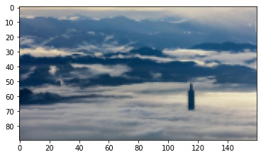
    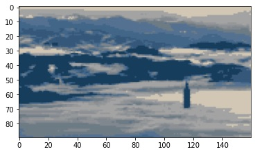

:pencil2: down-sampled version of `images/view4.jpg`, size of image: 50 x 80, number of colors: 10.

    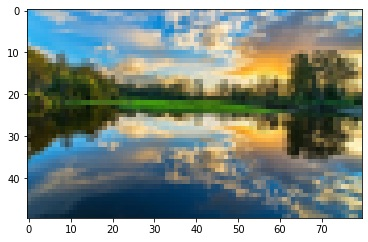
    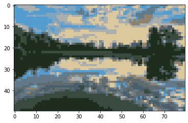

See more results in the `results/IP_DM_sparse` file.

## Nyström method
Another solution is to use the Nyström method. 

Nyström method approach the eigenvectors of diffusion matrix, which is essential in the diffusion map algorithm, without computing the entire matrix.  
In fact, it only compute the randomly picked *sam* columns of each matrices, where *sam* is a small number not larger than 20.

I implement this method in 2 slightly different way, described in `IP_DM_Nystrom_v1.ipynb` and `IP_DM_Nystrom_v2.ipynb`.

By using this method in both ways, image with 4,000,000 pixels can be divided without down-sampling!

### Results
:pencil2: `images/cat.jpg`, size of image: 660 x 1100, number of colors: 15, number of samples: 10.

    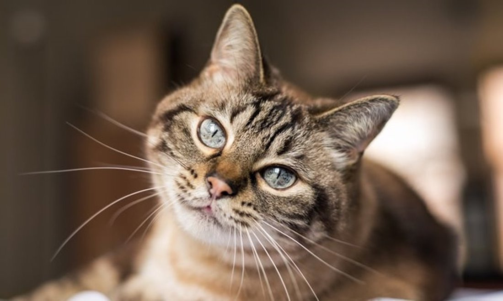
    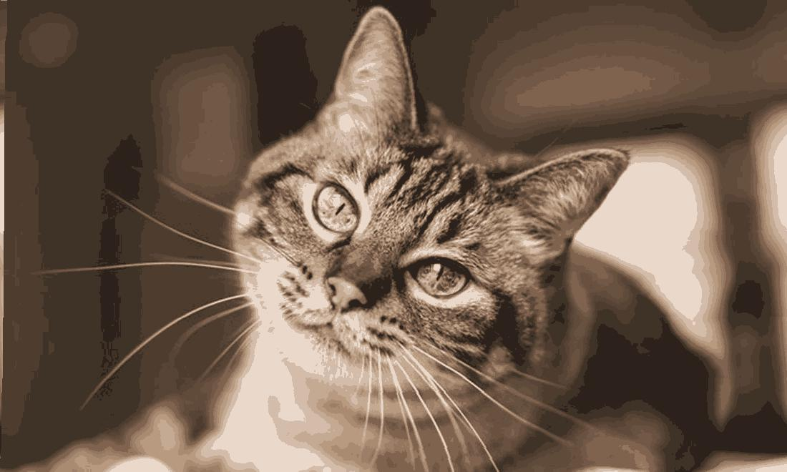

:pencil2: `images/view.jpg`, size of image: 900 x 1600, number of colors: 15, number of samples: 10.

    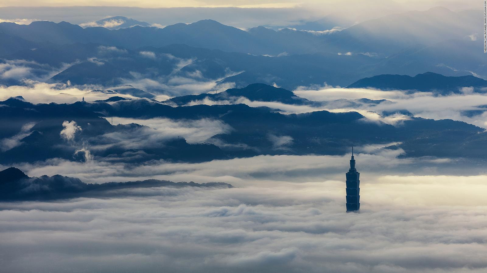
    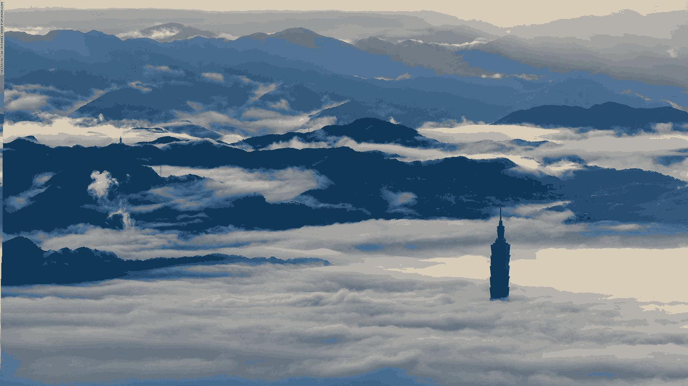

:pencil2: `images/view5.jpg`, size of image: 1350 x 2400, number of colors: 15, number of samples: 10.

    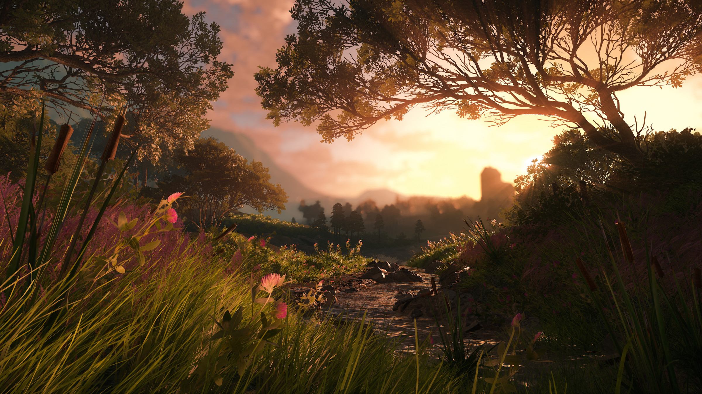
    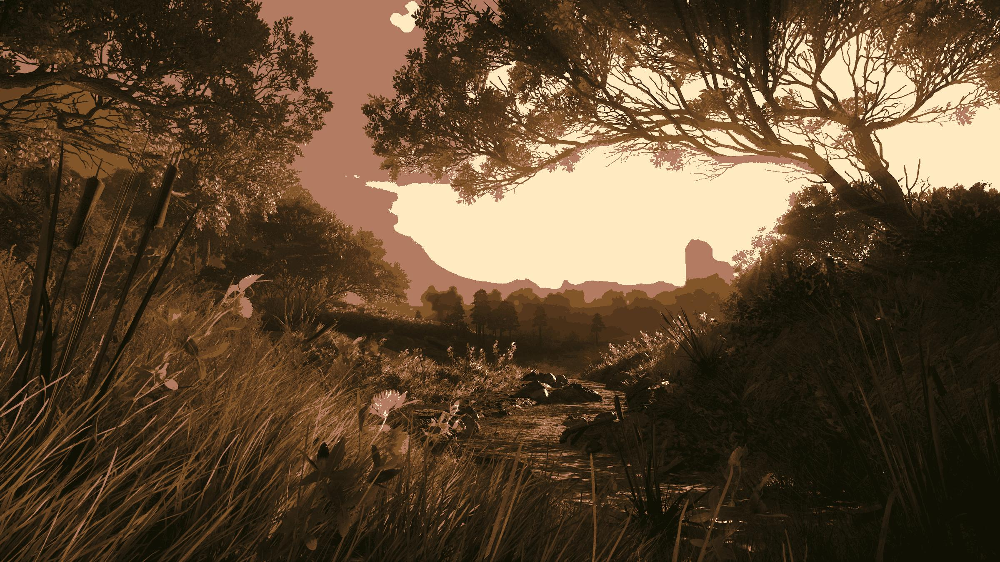

:pencil2: `images/view6.jpg`, size of image: 500 x 1000, number of colors: 15, number of samples: 10.

    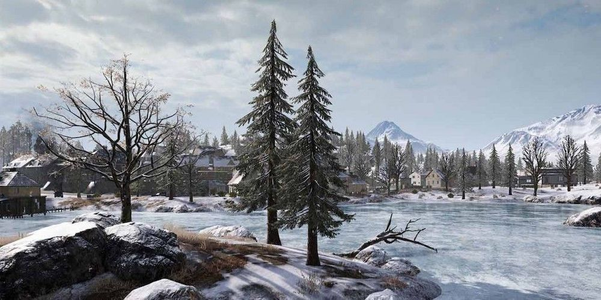
    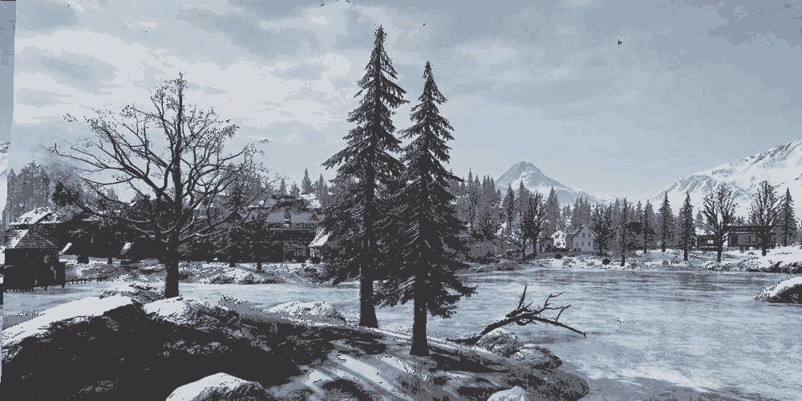

See more results in the `results/IP_DM_Nystrom_v1` and `results/IP_DM_Nystrom_v2` files.

## Comparison
- For image with number of pixels not larger than 10,000 , the Nythöm method algorithms are approximately 3,000 times faster compared with the sparse method algorithm.

- For image with number of pixels not larger than 10,000 , the Sparse method algorithm is more stabilize than the Nythöm method algorithms.

- For image with number of pixels over 10,000 , the Nythöm method is the only way to implement. 

- The time two Nyström method algorithms takes are barely different.

- The Elapsed time of k-means scales with the size of images.

### Image with number of pixels < 10,000

:pencil2: down-sampled version of `images/view3.jpg`, size of image: 75 x 120, number of colors: 20, number of samples: 7.

| | Sparse method | Nyström method v1 | Nyström method v2 |
| :---------------- | :----------------:| :----------------: | :----------------: |
|Elapsed time of diffusion maps|1min 30s|27.2 ms|27.4 ms|
|Elapsed time of k-means|718 ms|459 ms|543 ms|

Although the sparse method takes more time, it is more stabilize compared with the Nyström method.

### Image with number of pixels > 10,000

:pencil2: `images/cat.jpg`, size of image: 660 * 1100, number of colors: 15, number of samples: 10.

| | Nyström method v1 | Nyström method v2 |
| :---------------- | :----------------: | :----------------: |
|Elapsed time of diffusion maps|1.92 s|2.09 s|
|Elapsed time of k-means|13.9 s|14.5 s|

:pencil2: `images/flower.jpg` 1500 * 1000, size of image: 1500 * 1000, number of colors: 15, number of samples: 10.

| | Nyström method v1 | Nyström method v2 |
| :---------------- | :----------------: | :----------------: |
|Elapsed time of diffusion maps|4.25 s|3.87 s|
|Elapsed time of k-means|30 s|23.9 s|

:pencil2: `images/view3.jpg`, size of image: 1500 x 2400, number of colors: 15, number of samples: 10.

| | Nyström method v1 | Nyström method v2 |
| :---------------- | :----------------: | :----------------: |
|Elapsed time of diffusion maps|14.3 s|15.2 s|
|Elapsed time of k-means|1min 50s|1min 48s|

:pencil2: `images/view5.jpg`, size of image: 1350 * 2400, number of colors: 15, number of samples: 10.

| | Nyström method v1 | Nyström method v2 |
| :---------------- | :----------------: | :----------------: |
|Elapsed time of diffusion maps|12.6 s|12.6 s|
|Elapsed time of k-means|1min 21s|1min 7s|

## Conclusion
I completed the mission above: ease the calculated demand of diffusion map algorithm. However, new difficulty appeared.

### :mag: New trouble?
Since the Nyström method algorithm construct diffusion map without reducing data, large data set makes k-means time-consuming.  
I did not find a way to ease the calculated demand of this part, yet...

## References
[1] [Diffusion Maps Meet Nystrom](https://arxiv.org/abs/1802.08762)  
[2] [Spectral grouping using the Nystrom method](https://escholarship.org/uc/item/29z29233)
