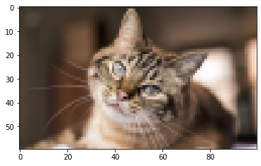
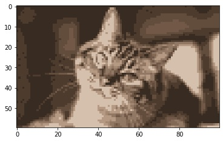

<h1 align="center">Image Partition and Color Reduction</h1>
<div align="center"><i>Divide an image into regions and save it using a few colors</i></div>
<br>

This project reveals the applications of diffusion maps in image partition and color reduction.

## Contents
- [Introduction](#Introduction)
- [Sparse method](#Sparse-method)
- [Nyström method](#Nyström-method)
- [Comparison](#Comparison)
- [Conclusion](#Conclusion)
- [References](#References)


## Introduction
To get good results for image partition, the [diffusion map](https://github.com/yujieho/Diffusion_Maps), which is effective in organizing noisy and unordered data, gives a posible solution. 


### :round_pushpin: Image partition
Done by using the diffusion map. 

:pencil2: ***Framework***

1. Treats each pixels as a 5-dimensional data (considering thier position and colors).
2. Map data to the diffusion space.
3. Cluster data in the diffusion space into groups via k-means.


### :round_pushpin: Color reduction
Done simultaneously by giving one color to each group after clustering.


### :mag: Problem of the computational complexity
The matrices in the diffusion map algorithm are of sizes *nxn*, where *n* is the number of pixels.  
This means that the computational complexity will scales with the size of images, the basic algorithm cannot used in dividing images with over 5,000 pixels.  

I found **3 solutions**, describing in the following sections, to deal with this problem.


## Sparse method
One solution is to construct every matrices that appeared in a sparse version.  
This method is implement in `IP_DM_sparse.ipynb`, which allows images with number of pixels no more than 10,000.

### Results
:pencil2: Results of down-sampled version of `images/cat.jpg`

<p align='center'>
    
    
</p>

:pencil2: Results of `images/cat.jpg`

<p align='center'>
    
    
</p>

See more results in the `results/IP_DM_sparse` file.


## Nyström method
Another solution is to use the Nyström method. 

Nyström method approach the eigenvectors of diffusion matrix, which is essential in the diffusion map algorithm, without computing the entire matrix.  
In fact, it only compute the first *c* columns of each matrices, where *c* is often a small number not larger than 10.

I implement this method in 2 slightly different way, described in `IP_DM_Nystrom_v1.ipynb` and `IP_DM_Nystrom_v2.ipynb`.

By using this method in both ways, image with 4,000,000 pixels can be divided without down-sampling!


### Results
See more results in the `results/IP_DM_Nystrom_v1` and `results/IP_DM_Nystrom_v2` files.


## Comparison

### :round_pushpin: Image with no more than 10,000 pixels

Down-sampled version of `images/flower.jpg` 


| | Sparse method | Nyström method v1 | Nyström method v2 |
| :---------------- | :----------------:| :----------------: | :----------------: |
|Elapsed time of diffusion maps|1|2|3|
|Elapsed time of k-means|1|2|3|

Although the sparse method takes more time, it is more stabilize compared with the Nyström method.

### :round_pushpin: Image with over 10,000 pixels

`images/cat.jpg`

| | Nyström method v1 | Nyström method v2 |
| :---------------- | :----------------: | :----------------: |
|Elapsed time of diffusion maps|1|2|
|Elapsed time of k-means|1|2|

`images/flower.jpg`

| | Nyström method v1 | Nyström method v2 |
| :---------------- | :----------------: | :----------------: |
|Elapsed time of diffusion maps|1|2|
|Elapsed time of k-means|1|2|

`images/view3.jpg`

| | Nyström method v1 | Nyström method v2 |
| :---------------- | :----------------: | :----------------: |
|Elapsed time of diffusion maps|1|2|
|Elapsed time of k-means|1|2|


`images/view5.jpg`

| | Nyström method v1 | Nyström method v2 |
| :---------------- | :----------------: | :----------------: |
|Elapsed time of diffusion maps|1|2|
|Elapsed time of k-means|1|2|


## References
[1] R.R. Coifman and S. Lafon, Diffusion maps, Applied and computational harmonic analysis, 21(1):5–30, 2006  
[2] J. de la Porte, B. M. Herbst, W. Hereman and S. J. van der Walt., An Introduction to Diffusion Maps, Proceedings of the Nineteenth Annual Symposium of the Pattern Recognition Association of South Africa, 2008  
[3] L. Zelnik-Manor and P. Perona, Self-Tuning Spectral Clustering, Advances in Neural Information Processing Systems 17, pp. 1601-1608, 2005, (NIPS’2004)


```python

```
