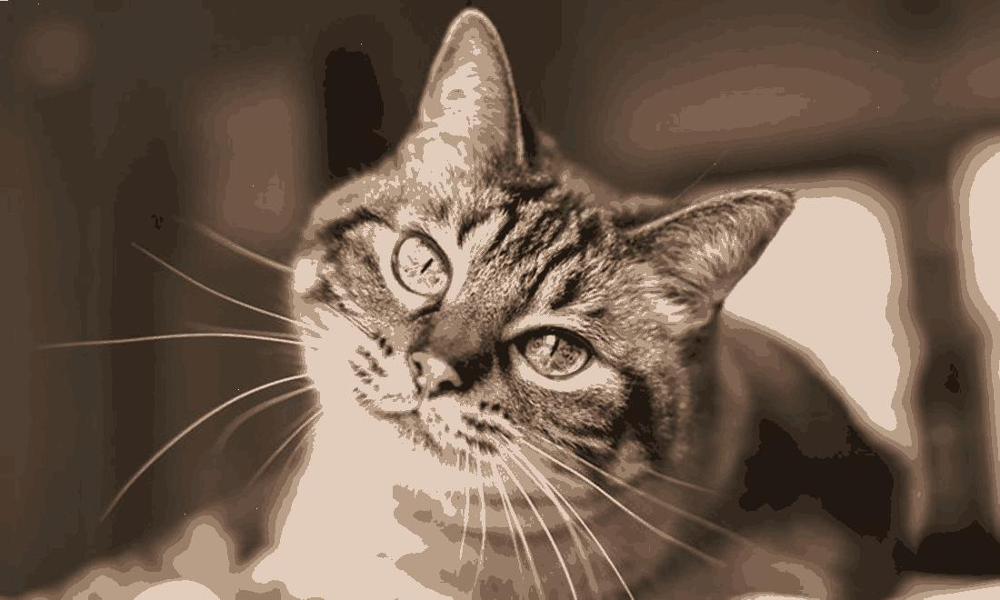
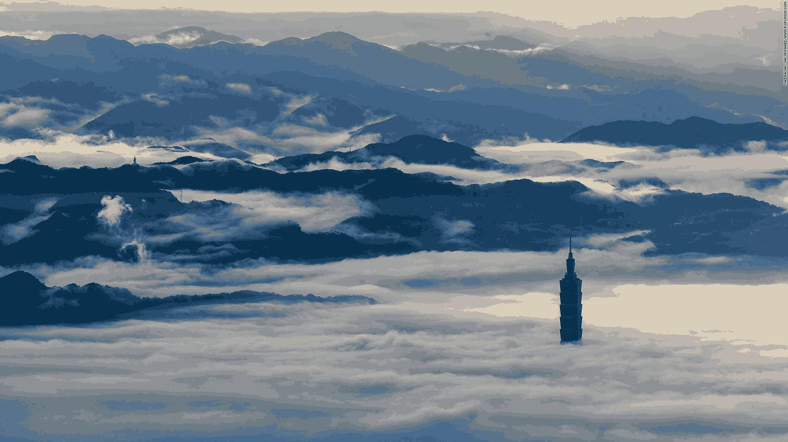
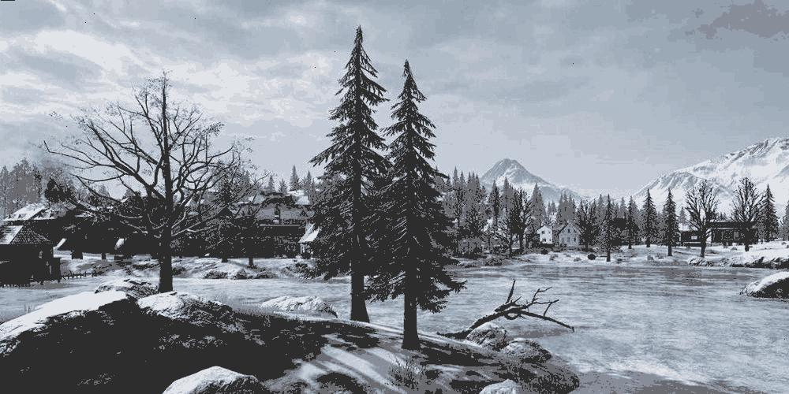

<h1 align="center">Image Partition and Color Reduction</h1>
<div align="center"><i>Divide an image into regions and reconstruct it using a few colors.</i></div>
<br>

This project reveals the applications of diffusion maps in image partition and color reduction.

## Contents
- [Introduction](#Introduction)
- [Sparse method](#Sparse-method)
- [Nyström method](#Nyström-method)
- [Comparison](#Comparison)
- [Conclusion](#Conclusion)
- [References](#References)


## Introduction
[diffusion maps](https://github.com/yujieho/Diffusion_Maps) is effective in organizing noisy and unordered data.

To get good results for image partition, it gives a posible solution. 


### :round_pushpin: Image partition
Done by using the diffusion map. 

    Framework
    
    1. Treats each pixels as a 5-dimensional data (considering thier position and colors).
    2. Map data to the diffusion space.
    3. Cluster data in the diffusion space into groups via k-means.


### :round_pushpin: Color reduction
Done simultaneously by giving one color to each group after clustering.


### :mag: Difficulty
The matrices in the diffusion map algorithm are of sizes *nxn*, where *n* is the number of pixels. 

The computational complexity scales with the size of images, the basic algorithm cannot used in dividing images with over 5,000 pixels.  

I found **3 solutions** to deal with this problem. Described below.


## Sparse method
Construct every matrices that appeared in a sparse version. 

Implemented in `IP_DM_sparse.ipynb`, it allows images with number of pixels no more than 10,000.


### Results
:pencil2: `images/cat.jpg`. left: down-sampled version of image, right: image after color reduction.
- size of image: 60 x 100
- number of colors: 10

<p align='center'>
    
    
</p>


:pencil2: `images/view.jpg`. left: down-sampled version of image, right: image after color reduction.
- size of image: 90 x 160
- number of colors: 10

<p align='center'>
    
    
</p>


:pencil2: `images/view4.jpg`. left: down-sampled version of image, right: image after color reduction.
- size of image: 50 x 80
- number of colors: 10

<p align='center'>
    
    
</p>


See more results in the `results/IP_DM_sparse` file.


## Nyström method
Approach the eigenvectors of diffusion matrix without computing the entire matrix. 

Implemented in 2 slightly different way, described in `IP_DM_Nystrom_v1.ipynb` and `IP_DM_Nystrom_v2.ipynb`.

Both algorithms compute only a few (no more than 20) randomly picked columns of each matrices.

In both ways, image with 4,000,000 pixels can be divided without down-sampling !


### Results
:pencil2: `images/cat.jpg`. left: original image, right: image after color reduction.
- size of image: 660 x 1100
- number of colors: 15
- number of samples: 10

<p align='center'>
    
    
</p>


:pencil2: `images/view.jpg`. left: original image, right: image after color reduction.
- size of image: 900 x 1600
- number of colors: 15
- number of samples: 10

<p align='center'>
    
    
</p>


:pencil2: `images/view5.jpg`. left: original image, right: image after color reduction.
- size of image: 1350 x 2400
- number of colors: 15
- number of samples: 10

<p align='center'>
    
    
</p>


:pencil2: `images/view6.jpg`. left: original image, right: image after color reduction.
- size of image: 500 x 1000
- number of colors: 15
- number of samples: 10

<p align='center'>
    
    
</p>

See more results in the `results/IP_DM_Nystrom_v1` and `results/IP_DM_Nystrom_v2` files.


## Comparison
For images with number of pixels< 10,000:
- The Nythöm method is approximately 3,000 times faster compared with the sparse method.

- The Sparse method is more stabilize than the Nythöm method.

For images with number of pixels > 10,000

- The Nythöm method is the only way to implement. 

- The time two Nyström method algorithms take are barely different.


### Images with number of pixels < 10,000

:pencil2: down-sampled version of `images/view3.jpg`, size of image: 75 x 120, number of colors: 20, number of samples: 7.

| | Sparse method | Nyström method v1 | Nyström method v2 |
| :---------------- | :----------------:| :----------------: | :----------------: |
|Elapsed time of diffusion maps|1min 30s|27.2 ms|27.4 ms|
|Elapsed time of k-means|718 ms|459 ms|543 ms|


### Images with number of pixels > 10,000

:pencil2: `images/cat.jpg`, size of image: 660 * 1100, number of colors: 15, number of samples: 10.

| | Nyström method v1 | Nyström method v2 |
| :---------------- | :----------------: | :----------------: |
|Elapsed time of diffusion maps|1.92 s|2.09 s|
|Elapsed time of k-means|13.9 s|14.5 s|


:pencil2: `images/flower.jpg`, size of image: 1500 * 1000, number of colors: 15, number of samples: 10.

| | Nyström method v1 | Nyström method v2 |
| :---------------- | :----------------: | :----------------: |
|Elapsed time of diffusion maps|4.25 s|3.87 s|
|Elapsed time of k-means|30 s|23.9 s|


:pencil2: `images/view3.jpg`, size of image: 1500 x 2400, number of colors: 15, number of samples: 10.

| | Nyström method v1 | Nyström method v2 |
| :---------------- | :----------------: | :----------------: |
|Elapsed time of diffusion maps|14.3 s|15.2 s|
|Elapsed time of k-means|1min 25s|1min 29s|


:pencil2: `images/view5.jpg`, size of image: 1350 * 2400, number of colors: 15, number of samples: 10.

| | Nyström method v1 | Nyström method v2 |
| :---------------- | :----------------: | :----------------: |
|Elapsed time of diffusion maps|12.6 s|12.6 s|
|Elapsed time of k-means|1min 21s|1min 7s|


## Conclusion
I completed the mission above: ease the calculated demand of diffusion map algorithm. 

However, new difficulty appeared.

### :mag: New trouble?
Since the Nyström method algorithm construct diffusion map without reducing data, large data set makes k-means time-consuming.  

I did not find a way to ease the calculated demand of this part, yet...


## References
[1] [Diffusion Maps Meet Nystrom](https://arxiv.org/abs/1802.08762)  
[2] [Spectral grouping using the Nystrom method](https://escholarship.org/uc/item/29z29233)


```python

```
